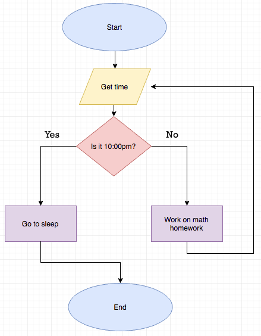

## Overview: Boolean Operators, Statements, and Expressions

In the previous lessons, we saw how if and else statements allow us to write code that can handle different situations by making comparisons between different numbers.

Comparison statements are centered around Boolean Logic, with the conditions evaluating to either true or false.

The values of these expressions are stored and used as boolean variables. Whenever we see the term boolean, it means we have something that can evaluate to true or false.

In these activities students will work with:

* Boolean flags and values (`True` and `False`)
* and
* or
* not

### Boolean Workflow



*Source: http://macs.cs.colostate.edu/modules/M4.A.html*

## Concept: Boolean Flags

Boolean values are regularly used to help maintain the state of a given piece of code. It is common to describe boolean variables as “boolean flags” - these often are used to turn on and off different behaviors that might be useful.

For example, stay in screen is a flag that we have set that forces the sprite to stay within the bounds of the screen when set to true.

```python
my_sprite.set_flag(SpriteFlag.STAY_IN_SCREEN, False)
```

### Example #1: Are you hungry? (Boolean Flag)

We can also code our own "flags" by setting up a variable to initially be `True` or `False`. We can then check for that value in our program in a statement that looks the same as for the other operators `<, >, !=, ==, >=, <=`.

1. Review the code below
2. Create a new project called `off_and_on`
3. Copy and paste the sample code and run the code
4. Identify what needs to be done in game to splash “You’re hungry!”, and what needs to be done to splash “You’re not hungry!”

```python
is_hungry = False

def on_b_pressed():
    if is_hungry:
        game.splash("You're hungry!")
    else:
        game.splash("You're not hungry!")
controller.B.on_event(ControllerButtonEvent.PRESSED, on_b_pressed)

def on_a_pressed():
    global is_hungry
    is_hungry = True
controller.A.on_event(ControllerButtonEvent.PRESSED, on_a_pressed)

game.splash("Press A if you are hungry!")
```

In this example, `is_hungry` is a flag that will change the behavior of the on `B button` pressed event. When it is off (set to `False`), the game assumes that you are not hungry; when you turn it on (set it to `True`), though, it tells the game that you are hungry, and it reacts to this information.

### Project #1: off_and_on

Use the code in the example above.

Modify the on `A button pressed event` in the `off_and_on` program so that it switches the value of `is_hungry` from `True` to `False` or from `False` to `True`, by using an `if-else` statement.

## Concept: `not`

When we have a boolean value, we have seen that we can write code that runs when it is true using a simple if statement. However, we can also run code for when the boolean is false. This is done with the `not` operator.

### Example #2: `not`

1. Review the code example below
2. Examine its use of the `not` operator

```python
is_hungry = False

def on_a_pressed():
    global is_hungry
    is_hungry = True
controller.A.on_event(ControllerButtonEvent.PRESSED, on_a_pressed)

def on_b_pressed():
    global is_hungry
    is_hungry = False
controller.B.on_event(ControllerButtonEvent.PRESSED, on_b_pressed)

my_sprite = sprites.create(img("""
        . . . . . . 5 . 5 . . . . . . .
        . . . . . f 5 5 5 f f . . . . .
        . . . . f 1 5 2 5 1 6 f . . . .
        . . . f 1 6 6 6 6 6 1 6 f . . .
        . . . f 6 6 f f f f 6 1 f . . .
        . . . f 6 f f d d f f 6 f . . .
        . . f 6 f d f d d f d f 6 f . .
        . . f 6 f d 3 d d 3 d f 6 f . .
        . . f 6 6 f d d d d f 6 6 f . .
        . f 6 6 f 3 f f f f 3 f 6 6 f .
        . . f f d 3 5 3 3 5 3 d f f . .
        . . f d d f 3 5 5 3 f d d f . .
        . . . f f 3 3 3 3 3 3 f f . . .
        . . . f 3 3 5 3 3 5 3 3 f . . .
        . . . f f f f f f f f f f . . .
        . . . . . f f . . f f . . . . .
    """),
    SpriteKind.player)

def on_update_interval():
    if not is_hungry:
        my_sprite.say("I'm not hungry", 2000)
game.on_update_interval(5000, on_update_interval)
```

Notice how the sprite will only say something if the variable `is_hungry` is not true.

`is_hungry` will automatically be equal to `True` if:

* the variable gets `True` -> `is_hungry == True`
* the variable has gets any value other than `0` or `None`. Meaning, it will be `True` if the value is:
  * a number -> `is_hungry == 1`
  * or a string -> `is_hungry == "yep"`
  * or an empty string -> `is_hungry == ''`

### Project #2: not_left (is_right)

1. Start a new project called `not_left`
2. Create a variable called `my_sprite` and assign it a sprite.
3. Add the MakeCode function to move `my_sprite`: `controller.move_sprite(my_sprite)`
4. Make a variable named `is_left` and set it equal to `False`
5. In the game `on_update()` function, assign the `is_left` variable to a `0 < 0` comparison.
   1. Replace the first `0` with the x position of `my_sprite`. You can get that value using `my_sprite.x`
   2. Replace the second `0` with `80`
6. Make it so that when the player presses the `A button`, if `is_left` is `False`, then the sprite should say something.

### The game update function

```python
def on_update():
    # your code goes here
game.on_update(on_update)
```

## Concept: Alternating Booleans

We can also use the `not` operator when assigning a boolean. So if we wanted to, we could assign a boolean to be the opposite of another boolean. Setting a boolean to the opposite value of itself, ‘switches’ the variable state from `True` to `False` (or `False` to `True`).

### Example #3: Alternating Booleans

1. Review the code example below
2. Examine its use of the `not` operator
3. Notice how the `not` operator is used to alternate the value of the variable `left`

```python
left = False

def on_a_pressed():
    global left
    left = not left
controller.A.on_event(ControllerButtonEvent.PRESSED, on_a_pressed)

def on_update_interval():
    global projectile
    if left:
        projectile = sprites.create_projectile(img("""
                . . . . . . . . . . . . . . . .
                . . . . . . . . . . . . . . . .
                . . . . . . . . . . . . . . . .
                . . . . . 9 9 . . . . . . . . .
                . . . . . 9 . 9 9 . . . . . . .
                . . . . . 9 . . . 9 9 . . . . .
                . . . . . 9 . . . . . 9 9 . . .
                . . . . . 9 . . . . . . . 9 9 .
                . . . . . 9 . . . . . . . . . 9
                . . . . . 9 . . . . . . . 9 9 .
                . . . . . 9 . . . . . 9 9 . . .
                . . . . . 9 . . . 9 9 . . . . .
                . . . . . 9 . 9 9 . . . . . . .
                . . . . . 9 9 . . . . . . . . .
                . . . . . . . . . . . . . . . .
                . . . . . . . . . . . . . . . .
            """),
            randint(50, 100),
            0,
            SpriteKind.player)
    else:
        projectile = sprites.create_projectile(img("""
                . . . . . . . . . . . . . . . .
                . . . . . . . . . . . . . . . .
                . . . . . . . . . 7 7 . . . . .
                . . . . . . . 7 7 . 7 . . . . .
                . . . . . 7 7 . . . 7 . . . . .
                . . . 7 7 . . . . . 7 . . . . .
                . 7 7 . . . . . . . 7 . . . . .
                7 . . . . . . . . . 7 . . . . .
                . 7 7 . . . . . . . 7 . . . . .
                . . . 7 7 . . . . . 7 . . . . .
                . . . . . 7 7 . . . 7 . . . . .
                . . . . . . . 7 7 . 7 . . . . .
                . . . . . . . . . 7 7 . . . . .
                . . . . . . . . . . . . . . . .
                . . . . . . . . . . . . . . . .
                . . . . . . . . . . . . . . . .
            """),
            randint(-100, -50),
            0,
            SpriteKind.player)
    projectile.y = randint(0, scene.screen_height())
game.on_update_interval(500, on_update_interval)
```

### Project #3: alternating_booleans

1. Create a new project called `alternating_booleans`
2. Add create a new sprite
3. Create a new variable called `pizza` and assign it `True`
4. Make this variable alternate boolean values when the player presses the `B button`
5. When the player presses the A, if `pizza == True`, then fire a pizza projectile, otherwise (else) fire a burger projectile

## Concept: `and` and `or`

Beyond just using a single boolean value, there are several ways in which we can combine these values. The most commonly used are `and` and `or`. These are used similarly to their usage in the English language; for example, the statement

> If I have food and I am hungry, I will make lunch

means that if both conditions (there being food, and being hungry) are `True`, then lunch will be made. If either is `False`, though, no lunch will be made.

Alternatively, the statement

> If I need to buy milk or I need to buy eggs, I will go to the store

means that if either condition is true, I will go to the store. If I don’t need to buy milk and I also don’t need to buy eggs, then I will not end up going to the store.

### Example #4a: `and`

1. Review the code below
2. Create the sample code and run the code
3. Identify which combinations of `True` and `False` evaluate to `True`, and which evaluate to `False`

```python
if True and True:
    game.splash("true and true is true")
else:
    game.splash("true and true is false")


if True and False:
    game.splash("true and false is true")
else:
    game.splash("true and false is false")


if False and False:
    game.splash("false and false is true")
else:
    game.splash("false and false is false")
```

### Example #4b: `or`

1. Review the code below
2. Create the sample code and run the code
3. Identify which combinations of `True` or `False` evaluate to `True`, and which evaluate to `False`

```python
if True or True:
    game.splash("true or true is true")
else:
    game.splash("true or true is false")


if True or False:
    game.splash("true or false is true")
else:
    game.splash("true or false is false")


if False or False:
    game.splash("false or false is true")
else:
    game.splash("false or false is false")
```

### Project #4: Using `and` and `or`

1. Create a new project called `and_or`
2. Create a sprite called `my_sprite`.
3. Add the MakeCode function to move `my_sprite` -> `controller.move_sprite(my_sprite)`
4. Add an `on_update()` function
5. In the `on_update()` function, add an if statement that makes the sprite say “hello” for 200 milliseconds when:
   1. the sprite x value is less than 30 **AND WHEN**
   2. the sprite y value is less than 30.
6. In the `on_update()` function, add another if statement that makes the sprite say “bye” for 200 ms when:
   1. the sprite x is greater than 80 **OR WHEN**
   2. the sprite y is greater than 80

#### Project #4 Optional Challenge

Create the same behavior while using one or more `not` operators.
