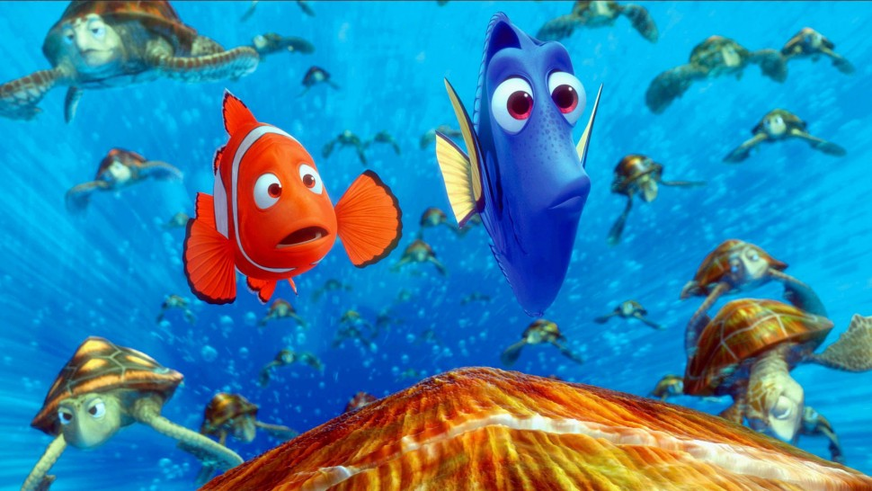

## Overview

Computers can use math to simulate our real world physics. Of course, computers can't mimic real physics, they can work within the boundaries of the equations that we use to represent physics. Combine that with the ability for computer programs to create objects on command (projectiles), and you have a recipe for most of the special effects graphics you see in most movies and games.

The water in *Finding Nemo* was generated using computers, and specifically Python code.

*Credit: Walt Disney*

## Concept: Physics

Complete the examples and activities on: [MakeCode Arcade](https://arcade.makecode.com/courses/csintro1/loops/physics)

## Concept: Projectiles

Complete the examples and activities on: [MakeCode Arcade](https://arcade.makecode.com/courses/csintro3/structure/projectiles)

## Project #1: particle_physics

1. Create a project called `particles_physics`
2. Use the examples in the two lessons above to write a program that uses:
   1. adds physics using:
      1. velocity (`vx`,`vy`)
      2. and/or acceleration (`ax`, `ay`)
   2. creates particles using:
      1. `def sprites.create_projectile_from_side(img: Image, vx: number, vy: number)`
      2. and/or `def sprites.create_projectile_from_sprite(img: Image, sprite: Sprite, vx: number, vy: number)`

## Optional Challenge

Use a `while` or `for` loop in your program.
